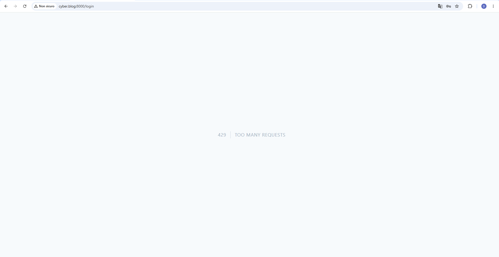
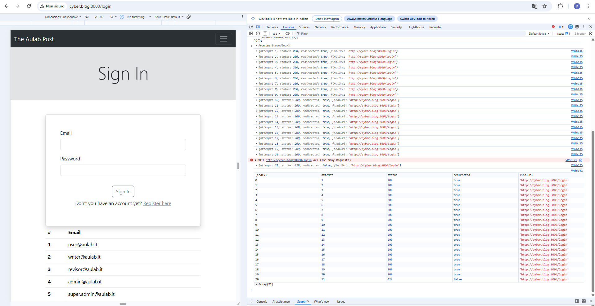
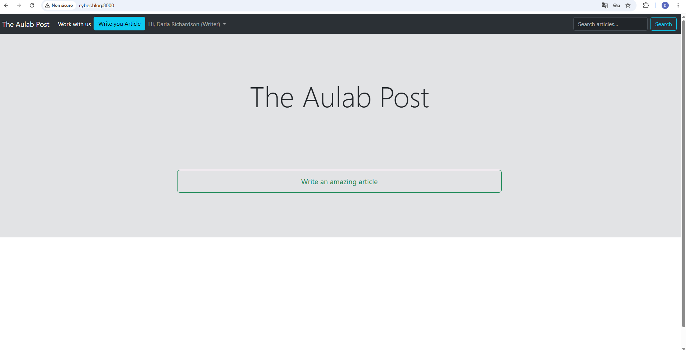

# Bonus 1 — Rate Limiter sul login Fortify

## Obiettivo

Il bonus richiedeva l'analisi e il rafforzamento del rate limiter applicato alla funzionalità di login gestita da Laravel Fortify.

Lo scopo del rate limiting è ridurre il rischio di attacchi automatizzati, come:

- brute force;
- credential stuffing;
- enumerazione massiva di account;
- tentativi distribuiti su più indirizzi email dallo stesso IP.

## Analisi iniziale

Il progetto utilizza Laravel Fortify per gestire l'autenticazione.

Le rotte coinvolte sono:

```text
GET  /login
POST /login
```

La richiesta di autenticazione viene gestita da:

```text
Laravel\Fortify\AuthenticatedSessionController@store
```

Nel file:

```text
app/Providers/FortifyServiceProvider.php
```

era già presente un rate limiter denominato `login`:

```php
RateLimiter::for('login', function (Request $request) {
    $throttleKey = Str::transliterate(
        Str::lower($request->input(Fortify::username()))
        .'|'.$request->ip()
    );

    return Limit::perMinute(5)->by($throttleKey);
});
```

La configurazione era collegata correttamente a Fortify tramite:

```php
'limiters' => [
    'login' => 'login',
    'two-factor' => 'two-factor',
],
```

Il limiter consentiva quindi un massimo di cinque tentativi al minuto per la combinazione:

```text
email normalizzata + indirizzo IP
```

La cronologia Git ha confermato che questa configurazione era già presente nel commit originario del progetto:

```text
bf8f1c7 Cyber Blog bugged
```

Il limiter base non è stato quindi introdotto durante il bonus, ma faceva già parte dell'applicazione iniziale.

## Test del limiter esistente

Per verificare il comportamento iniziale sono stati effettuati sei tentativi consecutivi con:

```text
Email: writer@aulab.it
Password: password-sbagliata
```

I primi cinque tentativi hanno restituito l'errore relativo alle credenziali non valide.

Il sesto tentativo è stato bloccato dal rate limiter con la risposta HTTP:

```text
429 Too Many Requests
```

### Evidenza del limiter esistente


Il test ha confermato che il limite per singolo account e indirizzo IP era già funzionante.

## Limite della configurazione iniziale

La configurazione iniziale proteggeva efficacemente un singolo account dai tentativi ripetuti provenienti dallo stesso IP.

Tuttavia, un client poteva utilizzare molte email differenti e mantenere ogni combinazione:

```text
email + IP
```

al di sotto della soglia di cinque tentativi.

In questo scenario lo stesso indirizzo IP avrebbe potuto inviare numerose richieste di login distribuite su account differenti.

## Rafforzamento del limiter

Il limiter è stato modificato introducendo due controlli distinti:

```php
RateLimiter::for('login', function (Request $request) {
    $email = Str::transliterate(
        Str::lower($request->input(Fortify::username()))
    );

    return [
        Limit::perMinute(20)
            ->by('login-ip:'.$request->ip()),

        Limit::perMinute(5)
            ->by('login-account:'.$email.'|'.$request->ip()),
    ];
});
```

La nuova configurazione applica:

```text
20 tentativi al minuto per indirizzo IP
5 tentativi al minuto per account + indirizzo IP
```

I prefissi:

```text
login-ip:
login-account:
```

rendono le chiavi dei due contatori chiaramente separate.

## Protezione per singolo account

Il secondo limite continua a proteggere ogni specifico account:

```php
Limit::perMinute(5)
    ->by('login-account:'.$email.'|'.$request->ip())
```

La chiave contiene:

```text
email normalizzata
+
indirizzo IP
```

Un attaccante non può quindi effettuare più di cinque tentativi al minuto contro lo stesso account dallo stesso indirizzo IP.

## Protezione globale per indirizzo IP

Il primo limite controlla invece il numero totale di richieste provenienti dallo stesso IP:

```php
Limit::perMinute(20)
    ->by('login-ip:'.$request->ip())
```

Questo controllo si applica indipendentemente dall'email utilizzata.

Serve quindi a limitare attacchi che distribuiscono i tentativi su molti indirizzi email differenti.

## Retest del limite per account

Dopo la modifica sono stati ripetuti sei tentativi con:

```text
Email: writer@aulab.it
Password: password-sbagliata
```

Il sesto tentativo ha continuato a restituire:

```text
429 Too Many Requests
```

Il nuovo limite globale non ha quindi compromesso il comportamento del limite per singolo account.

### Evidenza del limite per account



## Test del limite globale per IP

Per testare esclusivamente il nuovo limite globale sono state inviate ventuno richieste di login dallo stesso indirizzo IP.

Ogni richiesta utilizzava un indirizzo email differente:

```text
bonus1-<identificativo>-1@example.com
bonus1-<identificativo>-2@example.com
...
bonus1-<identificativo>-21@example.com
```

In questo modo nessun singolo account raggiungeva la soglia dei cinque tentativi.

I risultati sono stati:

```text
Tentativi 1–20 → status 200 dopo redirect verso /login
Tentativo 21   → status 429 senza redirect
```

Lo status `200` dei primi venti tentativi non indica un'autenticazione riuscita.

La funzione `fetch()` ha seguito il redirect generato dopo il fallimento delle credenziali e ha restituito lo status della pagina finale `/login`.

Il ventunesimo tentativo ha invece ricevuto direttamente:

```text
429 Too Many Requests
```

### Evidenza del limite globale per IP



Questo test dimostra che il nuovo contatore globale interviene anche quando vengono utilizzate email differenti.

## Scadenza temporanea del blocco

Il rate limiter non deve bloccare permanentemente l'utente.

Dopo la scadenza della finestra temporale è stato effettuato un login con credenziali valide:

```text
Email: writer@aulab.it
Password: password
```

L'autenticazione è stata completata correttamente e l'utente è stato reindirizzato alla home dell'applicazione.

### Evidenza del ripristino del login



Questo conferma che il blocco è temporaneo e che il normale funzionamento dell'autenticazione viene ripristinato automaticamente.

## Verifiche tecniche

È stato eseguito il controllo sintattico del provider:

```bash
/c/php/8.3/php.exe -l app/Providers/FortifyServiceProvider.php
```

Risultato:

```text
No syntax errors detected in app/Providers/FortifyServiceProvider.php
```

È stato inoltre eseguito:

```bash
git diff --check
```

Il comando non ha segnalato errori di whitespace.

## Conclusione

Il progetto possedeva già un rate limiter Fortify basato sulla combinazione tra email e indirizzo IP.

Durante il bonus la protezione è stata rafforzata applicando due livelli distinti:

```text
limite globale per IP
        +
limite specifico per account e IP
```

La nuova configurazione protegge sia il singolo account sia l'endpoint di login nel suo complesso.

I test hanno confermato che:

- il limite da cinque tentativi per account continua a funzionare;
- il limite da venti tentativi complessivi per IP entra in funzione;
- il ventunesimo tentativo con email differenti restituisce HTTP 429;
- il blocco è temporaneo;
- il login valido torna disponibile dopo la scadenza della finestra.