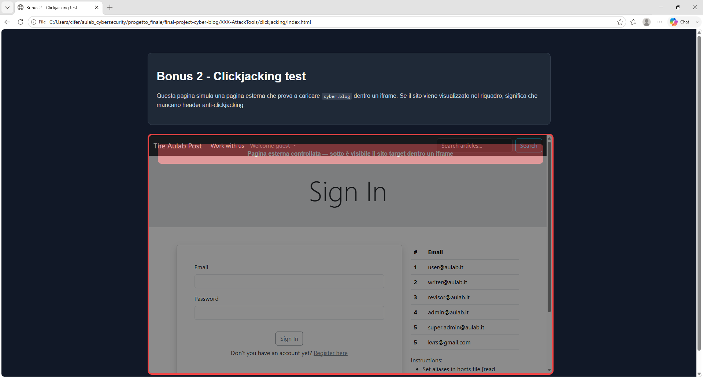
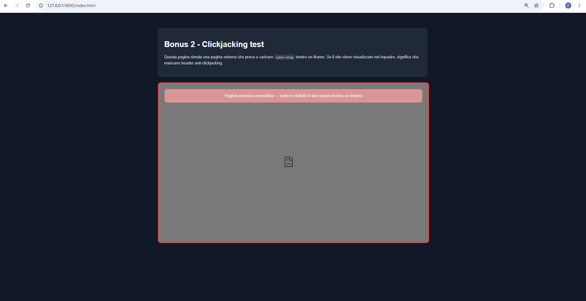

# Bonus 2 — Clickjacking

## Obiettivo

Il Bonus 2 richiede di adattare al progetto una pagina di test per simulare un possibile scenario di clickjacking.

Il clickjacking consiste nel caricare una pagina legittima all'interno di un iframe controllato da una pagina esterna, sovrapponendo eventualmente elementi grafici ingannevoli per indurre l'utente a interagire con il sito target senza rendersene conto.

Nel progetto il test è stato eseguito in locale, utilizzando la cartella:

```text
XXX-AttackTools/clickjacking
```

come area dedicata alla simulazione dell'attacco.

---

## Analisi iniziale

Prima della mitigazione è stato verificato se l'applicazione inviava header HTTP anti-clickjacking.

Sono stati controllati gli header della pagina di login e della home:

```bash
curl -I http://cyber.blog:8000/login | grep -Ei "x-frame-options|content-security-policy|frame-ancestors"
curl -I http://cyber.blog:8000/ | grep -Ei "x-frame-options|content-security-policy|frame-ancestors"
```

I comandi non hanno restituito header relativi a:

```text
X-Frame-Options
Content-Security-Policy
frame-ancestors
```

Questo indicava che il sito poteva essere potenzialmente caricato dentro un iframe da una pagina esterna.

---

## Pagina di test

È stata creata una pagina HTML nella cartella:

```text
XXX-AttackTools/clickjacking/index.html
```

La pagina simula un sito esterno che prova a caricare la login page del progetto dentro un iframe:

```html
<iframe src="http://cyber.blog:8000/login?bonus2_after_test=1"></iframe>
```
Il parametro in query string è stato usato come cache-buster durante il retest, in modo da forzare il browser a richiedere nuovamente la pagina target dopo l'applicazione degli header.
Per rendere il test visibile, l'iframe è stato inserito dentro un riquadro evidenziato, con un overlay che simula una pagina esterna controllata.

---

## Test prima della mitigazione

La pagina di test è stata inizialmente aperta direttamente dal browser.

Il risultato ha mostrato che la pagina di login di `cyber.blog` veniva caricata correttamente dentro l'iframe.

Questo comportamento confermava che il browser non stava ricevendo istruzioni per impedire l'incorniciamento della pagina.

### Evidenza prima della mitigazione



---

## Mitigazione

La mitigazione è stata implementata tramite un middleware dedicato:

```text
app/Http/Middleware/FrameGuard.php
```

Il middleware aggiunge due header HTTP alle risposte dell'applicazione:

```php
$response->headers->set('X-Frame-Options', 'SAMEORIGIN');
$response->headers->set('Content-Security-Policy', "frame-ancestors 'self'");
```

Il primo header:

```text
X-Frame-Options: SAMEORIGIN
```

indica al browser che la pagina può essere caricata in un frame soltanto da una pagina appartenente allo stesso origin.

Il secondo header:

```text
Content-Security-Policy: frame-ancestors 'self'
```

definisce una regola CSP più moderna, indicando che soltanto lo stesso sito può incorporare la pagina dentro iframe, frame, object o embed.

---

## Middleware FrameGuard

Il middleware creato è:

```php
<?php

namespace App\Http\Middleware;

use Closure;
use Illuminate\Http\Request;
use Symfony\Component\HttpFoundation\Response;

class FrameGuard
{
    public function handle(Request $request, Closure $next): Response
    {
        $response = $next($request);

        $response->headers->set('X-Frame-Options', 'SAMEORIGIN');
        $response->headers->set('Content-Security-Policy', "frame-ancestors 'self'");

        return $response;
    }
}
```

---

## Registrazione del middleware

Il middleware è stato registrato globalmente nel file:

```text
bootstrap/app.php
```

tramite:

```php
$middleware->append(FrameGuard::class);
```

La registrazione è stata inserita dentro il blocco:

```php
->withMiddleware(function (Middleware $middleware) {
    // $middleware->append(RateLimit::class);
    $middleware->append(FrameGuard::class);

    $middleware->alias([
        'admin' => App\Http\Middleware\UserIsAdmin::class,
        'revisor' => App\Http\Middleware\UserIsRevisor::class,
        'writer' => App\Http\Middleware\UserIsWriter::class,
        'admin.local' => App\Http\Middleware\OnlyLocalAdmin::class,
    ]);
})
```

In questo modo la protezione viene applicata alle risposte dell'applicazione.

---

## Verifica degli header dopo la mitigazione

Dopo aver registrato il middleware e pulito la cache dell'applicazione, sono stati rieseguiti i controlli sugli header:

```bash
curl -s -D - -o /dev/null "http://cyber.blog:8000/login?bonus2_check=1" | grep -Ei "HTTP/|x-frame-options|content-security-policy|cache-control"
curl -s -D - -o /dev/null "http://cyber.blog:8000/?bonus2_check=1" | grep -Ei "HTTP/|x-frame-options|content-security-policy|cache-control"
```

L'output ha confermato la presenza degli header:

```text
HTTP/1.1 200 OK
Cache-Control: no-cache, private
X-Frame-Options: SAMEORIGIN
Content-Security-Policy: frame-ancestors 'self'
```

La verifica è stata eseguita sia sulla pagina di login sia sulla home.

---

## Retest dopo la mitigazione

Per rendere il test più realistico, la pagina di clickjacking è stata servita tramite un piccolo server locale separato:

```bash
cd XXX-AttackTools/clickjacking
php -S 127.0.0.1:9000
```

La pagina è stata quindi aperta da:

```text
http://127.0.0.1:9000/index.html
```

mentre il sito target rimaneva:

```text
http://cyber.blog:8000
```

Essendo due origin diversi, l'header:

```text
Content-Security-Policy: frame-ancestors 'self'
```

ha impedito alla pagina esterna di caricare correttamente il sito target dentro l'iframe.

Dopo la mitigazione, l'iframe non mostra più la pagina di login ma un contenuto bloccato dal browser.

### Evidenza dopo la mitigazione



---

## Verifica funzionale

Dopo la mitigazione è stato verificato che:

- la home continua a rispondere correttamente;
- la pagina di login continua a essere raggiungibile direttamente;
- gli header anti-clickjacking sono presenti nelle risposte HTTP;
- una pagina esterna non può più incorporare correttamente la login page dentro un iframe;
- il middleware viene applicato globalmente alle risposte dell'applicazione.

---

## Conclusione

Il Bonus 2 è stato completato creando una pagina di test controllata per simulare il clickjacking e aggiungendo una mitigazione tramite header HTTP.

Prima della mitigazione, la pagina di login poteva essere caricata dentro un iframe esterno.

Dopo la mitigazione, il browser riceve gli header:

```text
X-Frame-Options: SAMEORIGIN
Content-Security-Policy: frame-ancestors 'self'
```

e blocca l'incorporamento della pagina da un origin diverso.

La protezione riduce il rischio di clickjacking e rende più sicura l'interazione degli utenti con l'applicazione.