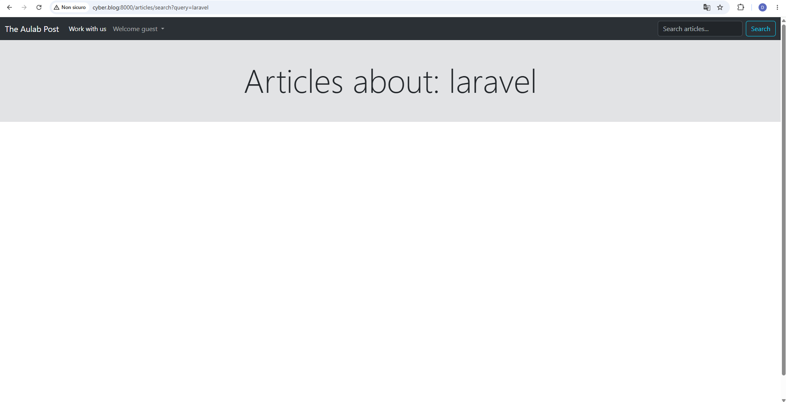
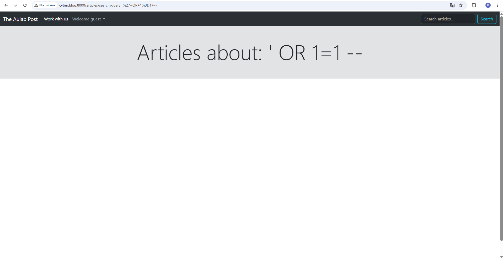
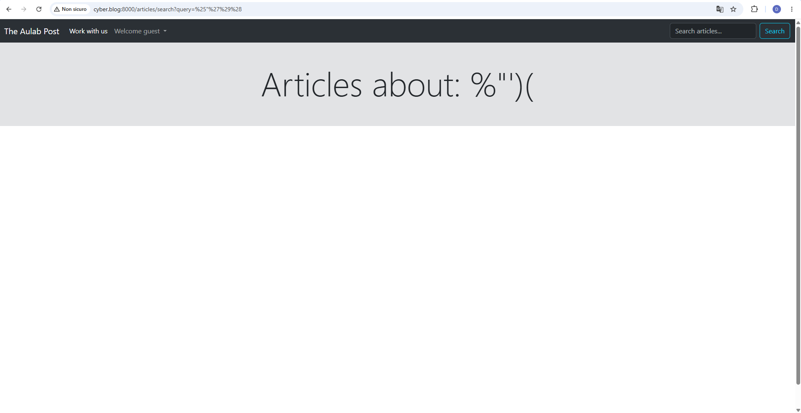
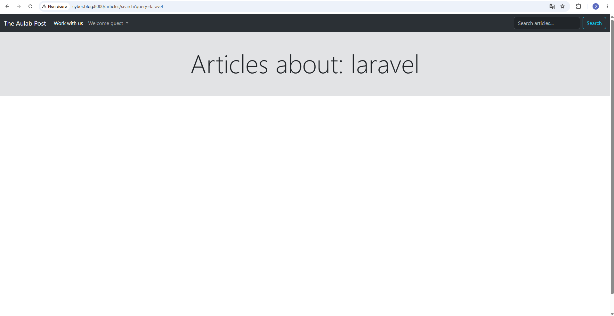
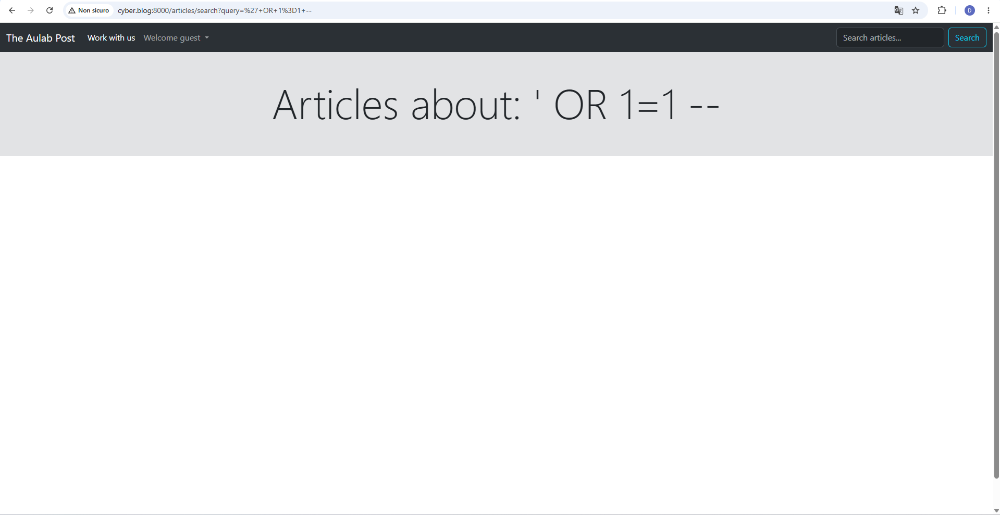

# Bonus 3 — Laravel Scout e SQL Injection

## Obiettivo

Il Bonus 3 richiede di analizzare la funzione di ricerca full text implementata con Laravel Scout e verificarne il comportamento rispetto a possibili tentativi di SQL injection.

L'obiettivo non è introdurre una nuova funzionalità complessa, ma verificare che il flusso di ricerca non costruisca query SQL manuali concatenando input provenienti dall'utente.

---

## Analisi iniziale

Nel progetto è installato Laravel Scout:

```text
laravel/scout v10.8.6
```

Il pacchetto è presente in `composer.json`:

```json
"laravel/scout": "^10.8"
```

e in `composer.lock`.

---

## Modello Article

Il modello `Article` utilizza il trait `Searchable` di Laravel Scout:

```php
use Laravel\Scout\Searchable;

class Article extends Model
{
    use HasFactory, Searchable;
}
```

Questo indica che il modello può essere indicizzato e ricercato tramite il motore configurato da Scout.

Il modello definisce inoltre i dati che devono essere resi disponibili all'indice di ricerca tramite il metodo `toSearchableArray()`:

```php
public function toSearchableArray()
{
    return [
        'id' => $this->id,
        'title' => $this->title,
        'subtitle' => $this->subtitle,
        'body' => $this->body,
        'category' => $this->category,
    ];
}
```

I campi coinvolti nella ricerca sono quindi:

```text
id
title
subtitle
body
category
```

---

## Configurazione Scout

Nel file:

```text
config/scout.php
```

il driver viene configurato tramite variabile d'ambiente:

```php
'driver' => env('SCOUT_DRIVER', 'tntsearch'),
```

In assenza di una diversa configurazione nel file `.env`, il driver utilizzato è quindi:

```text
tntsearch
```

Il flusso di ricerca passa da Laravel Scout invece che da query SQL scritte manualmente nel controller.

---

## Rotta di ricerca

La rotta interessata è:

```php
Route::get('/articles/search', [ArticleController::class, 'articleSearch'])
    ->middleware('throttle:article-search')
    ->name('articles.search');
```

Questa rotta è pubblica e permette di ricercare articoli tramite parametro `query`.

È presente anche un rate limiter dedicato già implementato nella Challenge 1:

```text
throttle:article-search
```

---

## Controller prima della micro-validazione

Il metodo `articleSearch()` utilizzava direttamente il valore proveniente dalla request:

```php
public function articleSearch(Request $request)
{
    $query = $request->input('query');

    $articles = Article::search($query)
        ->where('is_accepted', true)
        ->orderBy('created_at', 'desc')
        ->get();

    return view('articles.search-index', compact('articles', 'query'));
}
```

Il punto importante è che la ricerca veniva già eseguita tramite:

```php
Article::search($query)
```

Non erano presenti query SQL manuali del tipo:

```php
whereRaw("title LIKE '%$query%'")
```

oppure:

```php
DB::select("SELECT * FROM articles WHERE title LIKE '%$query%'")
```

Questo riduce il rischio di SQL injection nel flusso di ricerca, perché l'input dell'utente non viene concatenato manualmente dentro una stringa SQL.

---

## Controllo del codice

È stato eseguito un controllo nel progetto per cercare eventuali query manuali collegate alla ricerca:

```bash
grep -Rni "whereRaw\|DB::select\|selectRaw\|LIKE\|like\|Article::search\|articleSearch" app routes resources | head -n 120
```

Il risultato ha evidenziato il metodo `articleSearch()` e la rotta `/articles/search`, ma non ha mostrato costruzioni SQL manuali pericolose legate alla ricerca degli articoli.

Il flusso effettivo rimane:

```text
request query
→ Article::search($query)
→ filtro is_accepted
→ ordinamento
→ risultati
```

---

## View dei risultati

La view utilizzata è:

```text
resources/views/articles/search-index.blade.php
```

Nel titolo della pagina viene mostrata la query ricercata:

```blade
<h1 class="display-1">Articles about: {{$query}}</h1>
```

La sintassi Blade con doppie graffe:

```blade
{{$query}}
```

esegue escaping automatico dell'output, evitando che il valore venga stampato come HTML eseguibile.

---

## Test prima della micro-validazione

Sono stati eseguiti tre test tramite browser sulla rotta:

```text
/articles/search
```

### Ricerca normale

Input:

```text
laravel
```

Il risultato ha mostrato la pagina dei risultati senza errori.



---

### Input SQL-like

Input:

```text
' OR 1=1 --
```

Il payload è stato trattato come testo di ricerca.

Non sono comparsi:

```text
errori SQL
stack trace
dump
crash dell'applicazione
ritorno indiscriminato di tutti gli articoli
```



---

### Input con caratteri speciali

Input:

```text
%"')(
```

Anche questo input è stato renderizzato come testo di ricerca.

Non sono comparsi errori SQL o eccezioni Laravel.



---

## Micro-validazione aggiunta

Anche se il flusso era già basato su Laravel Scout, è stata aggiunta una micro-validazione sul parametro pubblico `query`.

Il metodo aggiornato è:

```php
public function articleSearch(Request $request)
{
    $validated = $request->validate([
        'query' => 'nullable|string|max:255',
    ]);

    $query = $validated['query'] ?? '';

    $articles = Article::search($query)
        ->where('is_accepted', true)
        ->orderBy('created_at', 'desc')
        ->get();

    return view('articles.search-index', compact('articles', 'query'));
}
```

La validazione impone che `query` sia:

```text
opzionale
stringa
massimo 255 caratteri
```

Questa modifica non sostituisce Scout e non trasforma la ricerca in SQL manuale. Serve invece a limitare forma e dimensione dell'input accettato dalla rotta pubblica.

---

## Retest dopo la micro-validazione

Dopo la modifica al controller, sono stati rieseguiti gli stessi test.

### Ricerca normale dopo la validazione

Input:

```text
laravel
```

La pagina continua a rispondere correttamente.



---

### Input SQL-like dopo la validazione

Input:

```text
' OR 1=1 --
```

Il payload continua a essere trattato come stringa di ricerca.

Non vengono generati errori SQL.



---

### Caratteri speciali dopo la validazione

Input:

```text
%"')(
```

La pagina continua a essere renderizzata correttamente e l'input viene mostrato come testo.


---

## Verifica sintattica

Dopo la modifica è stato eseguito il controllo sintattico PHP:

```bash
php -l app/Http/Controllers/ArticleController.php
```

Risultato:

```text
No syntax errors detected in app/Http/Controllers/ArticleController.php
```

È stato inoltre eseguito:

```bash
git diff --check
```

senza segnalazioni di whitespace.

---

## Conclusione

Il Bonus 3 conferma che la ricerca articoli è implementata tramite Laravel Scout:

```php
Article::search($query)
```

e non tramite query SQL manuali costruite concatenando input dell'utente.

I payload SQL-like testati non hanno generato errori SQL, crash o ritorno indiscriminato di risultati.

La micro-validazione aggiunta al controller migliora ulteriormente il flusso perché limita il parametro pubblico `query` a una stringa opzionale di massimo 255 caratteri.

La protezione finale si basa quindi su due aspetti:

```text
uso di Laravel Scout per la ricerca full text
+
validazione dell'input pubblico prima della ricerca
```

Questo rende il flusso più robusto e riduce il rischio di SQL injection nella funzionalità di ricerca articoli.