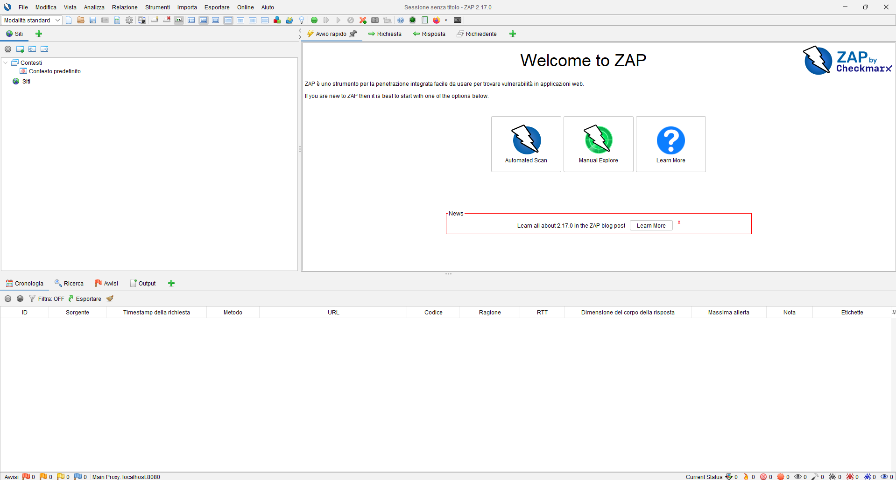
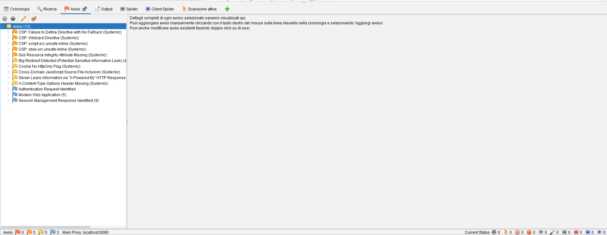
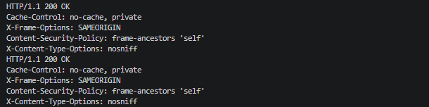

# Bonus 4 — OWASP ZAP Scan

## Obiettivo

Il Bonus 4 richiede di eseguire una scansione dell'applicazione tramite OWASP ZAP, analizzare gli avvisi rilevati e applicare eventuali miglioramenti di sicurezza al progetto.

L'obiettivo è utilizzare uno strumento automatico di security testing per individuare possibili punti deboli dell'applicazione e migliorare la configurazione degli header HTTP.

---

## Installazione di OWASP ZAP

OWASP ZAP è stato installato in ambiente Windows tramite `winget`.

Il pacchetto individuato è stato:

```text
Zed Attack Proxy [ZAP.ZAP]
Versione: 2.17.0
```

Durante l'installazione è stata installata anche la dipendenza Java richiesta:

```text
Eclipse Temurin JRE with Hotspot 17
```

L'installazione è terminata correttamente.

---

## Avvio dello strumento

Dopo l'installazione, OWASP ZAP è stato avviato in modalità standard.

La sessione è stata utilizzata per analizzare l'applicazione locale:

```text
http://cyber.blog:8000
```



---

## Target della scansione

Il target analizzato è stato il sito principale del progetto:

```text
http://cyber.blog:8000
```

La scansione è stata eseguita sull'ambiente locale del progetto Laravel.

---

## Risultati iniziali della scansione

Dopo la scansione, OWASP ZAP ha rilevato diversi avvisi di sicurezza.

Tra gli avvisi principali emersi erano presenti:

```text
CSP: Failure to Define Directive with No Fallback
CSP: Wildcard Directive
CSP: script-src unsafe-inline
CSP: style-src unsafe-inline
Sub Resource Integrity Attribute Missing
Big Redirect Detected
Cookie No HttpOnly Flag
Cross-Domain JavaScript Source File Inclusion
Server Leaks Information via X-Powered-By HTTP Response
X-Content-Type-Options Header Missing
Authentication Request Identified
Modern Web Application
Session Management Response Identified
```

La lista degli avvisi è stata utilizzata come base per individuare alcune mitigazioni applicabili senza modificare in modo invasivo la struttura del progetto.



---

## Analisi degli avvisi

Gli avvisi relativi alla Content Security Policy indicano che la policy potrebbe essere ulteriormente irrigidita.

Nel progetto è già presente una protezione anti-clickjacking tramite:

```text
X-Frame-Options: SAMEORIGIN
Content-Security-Policy: frame-ancestors 'self'
```

Tuttavia, una CSP completa richiederebbe una revisione più ampia degli script utilizzati dall'applicazione, in particolare perché il progetto utilizza anche risorse esterne e componenti JavaScript.

Per questo motivo, sono stati scelti due interventi mirati sugli header HTTP:

```text
X-Content-Type-Options Header Missing
Server Leaks Information via X-Powered-By HTTP Response
```

Questi due avvisi sono stati mitigati intervenendo sul middleware già usato per la protezione degli header.

---

## Middleware utilizzato

Il middleware interessato è:

```text
app/Http/Middleware/FrameGuard.php
```

Prima del Bonus 4 il middleware gestiva già gli header anti-clickjacking:

```php
$response->headers->set('X-Frame-Options', 'SAMEORIGIN');
$response->headers->set('Content-Security-Policy', "frame-ancestors 'self'");
```

---

## Mitigazione applicata

Il middleware è stato aggiornato aggiungendo:

```text
X-Content-Type-Options: nosniff
```

e rimuovendo l'header:

```text
X-Powered-By
```

La versione aggiornata del middleware è:

```php
<?php

namespace App\Http\Middleware;

use Closure;
use Illuminate\Http\Request;
use Symfony\Component\HttpFoundation\Response;

class FrameGuard
{
    public function handle(Request $request, Closure $next): Response
    {
        $response = $next($request);

        $response->headers->set('X-Frame-Options', 'SAMEORIGIN');
        $response->headers->set('Content-Security-Policy', "frame-ancestors 'self'");
        $response->headers->set('X-Content-Type-Options', 'nosniff');
        $response->headers->remove('X-Powered-By');

        if (function_exists('header_remove')) {
            header_remove('X-Powered-By');
        }

        return $response;
    }
}
```

---

## Spiegazione della mitigazione

L'header:

```text
X-Content-Type-Options: nosniff
```

indica al browser di non tentare di interpretare automaticamente il tipo di contenuto della risposta in modo diverso rispetto al `Content-Type` dichiarato.

Questo riduce il rischio legato al MIME sniffing.

La rimozione di:

```text
X-Powered-By
```

riduce invece l'esposizione di informazioni tecniche sul server, evitando di mostrare direttamente la versione PHP utilizzata.

---

## Verifica degli header

Dopo la modifica è stata pulita la cache applicativa:

```bash
php artisan optimize:clear
```

Poi sono stati verificati gli header HTTP tramite `curl`.

Comando usato sulla home:

```bash
curl -s -D - -o /dev/null "http://cyber.blog:8000/?bonus4_headers=2" | grep -Ei "HTTP/|x-frame-options|content-security-policy|x-content-type-options|x-powered-by|cache-control"
```

Comando usato sulla pagina di login:

```bash
curl -s -D - -o /dev/null "http://cyber.blog:8000/login?bonus4_headers=2" | grep -Ei "HTTP/|x-frame-options|content-security-policy|x-content-type-options|x-powered-by|cache-control"
```

Il risultato ha mostrato:

```text
HTTP/1.1 200 OK
Cache-Control: no-cache, private
X-Frame-Options: SAMEORIGIN
Content-Security-Policy: frame-ancestors 'self'
X-Content-Type-Options: nosniff

HTTP/1.1 200 OK
Cache-Control: no-cache, private
X-Frame-Options: SAMEORIGIN
Content-Security-Policy: frame-ancestors 'self'
X-Content-Type-Options: nosniff
```

L'header `X-Powered-By` non viene più mostrato nella risposta filtrata.



---

## Verifica sintattica

Dopo la modifica è stato eseguito il controllo sintattico PHP:

```bash
php -l app/Http/Middleware/FrameGuard.php
```

Risultato:

```text
No syntax errors detected in app/Http/Middleware/FrameGuard.php
```

È stato inoltre eseguito:

```bash
git diff --check
```

senza segnalazioni di whitespace.

---

## Verifica funzionale

Dopo la modifica è stato verificato che:

```text
la home risponde correttamente
la pagina di login risponde correttamente
gli header anti-clickjacking sono ancora presenti
l'header X-Content-Type-Options viene aggiunto correttamente
l'header X-Powered-By non viene più mostrato
```

Gli header finali applicati alle risposte principali sono:

```text
X-Frame-Options: SAMEORIGIN
Content-Security-Policy: frame-ancestors 'self'
X-Content-Type-Options: nosniff
```

---

## Conclusione

Il Bonus 4 è stato completato eseguendo una scansione dell'applicazione locale tramite OWASP ZAP.

Gli avvisi rilevati sono stati analizzati e sono state applicate mitigazioni mirate sugli header HTTP.

In particolare, è stato aggiunto:

```text
X-Content-Type-Options: nosniff
```

ed è stata rimossa l'esposizione dell'header:

```text
X-Powered-By
```

La configurazione finale migliora la sicurezza delle risposte HTTP e riduce l'esposizione di informazioni tecniche sul server.

Gli alert relativi alla Content Security Policy sono stati valutati come possibili miglioramenti futuri, perché richiederebbero una revisione più ampia degli script e delle risorse esterne utilizzate dal progetto.