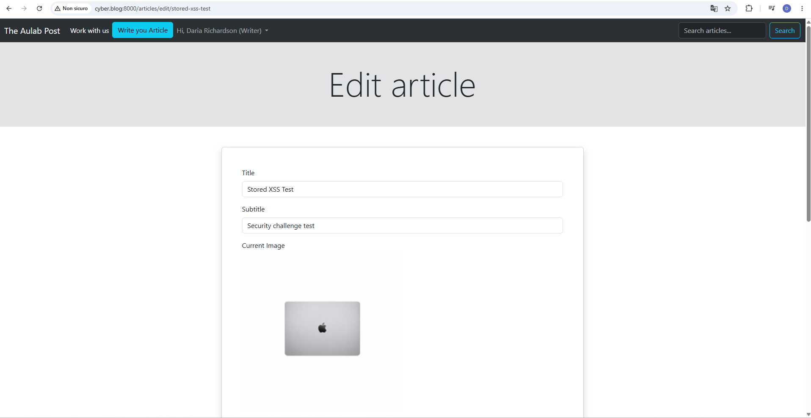
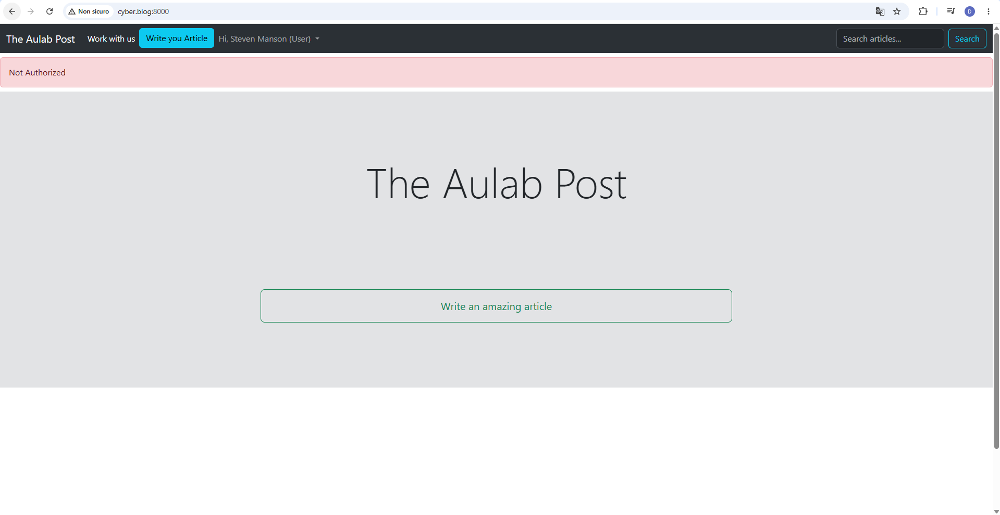

# Bonus 5 — Laravel Policies

## Obiettivo

Il Bonus 5 richiede di migliorare la gestione delle autorizzazioni del progetto utilizzando le Policies di Laravel.

L'obiettivo è spostare la logica di autorizzazione fuori dal controller, centralizzandola in una classe dedicata.

Nel progetto è stata scelta la gestione degli articoli, perché un articolo deve poter essere modificato o cancellato solo dal proprio autore.

---

## Analisi iniziale

Prima della modifica, nel controller era presente un controllo manuale all'interno del metodo `edit()`.

Nel file:

```text
app/Http/Controllers/ArticleController.php
```

era presente una logica di questo tipo:

```php
if(Auth::user()->id != $article->user_id){
    return redirect()->route('homepage')->with('alert', 'Accesso non consentito');
}
```

Questo controllo impediva a un utente diverso dall'autore di accedere alla pagina di modifica dell'articolo.

Tuttavia, questa logica era scritta direttamente nel controller.

---

## Problema individuato

Il controllo manuale dentro il controller funziona, ma presenta alcuni limiti:

```text
la logica di autorizzazione è mescolata alla logica del controller
la stessa regola potrebbe essere duplicata in più metodi
update() e destroy() devono essere protetti in modo esplicito
il codice risulta meno centralizzato e meno manutenibile
```

Per questo motivo la logica è stata spostata in una Policy dedicata.

---

## Controller base

Per poter usare il metodo:

```php
$this->authorize(...)
```

è stato aggiornato il controller base.

File modificato:

```text
app/Http/Controllers/Controller.php
```

Versione aggiornata:

```php
<?php

namespace App\Http\Controllers;

use Illuminate\Foundation\Auth\Access\AuthorizesRequests;

abstract class Controller
{
    use AuthorizesRequests;
}
```

Il trait `AuthorizesRequests` permette ai controller di utilizzare i metodi di autorizzazione integrati di Laravel.

---

## Creazione della Policy

È stata creata una Policy dedicata al model `Article`.

File creato:

```text
app/Policies/ArticlePolicy.php
```

La Policy contiene le regole di autorizzazione per modificare e cancellare un articolo.

```php
<?php

namespace App\Policies;

use App\Models\Article;
use App\Models\User;

class ArticlePolicy
{
    public function update(User $user, Article $article): bool
    {
        return $user->id === $article->user_id;
    }

    public function delete(User $user, Article $article): bool
    {
        return $user->id === $article->user_id;
    }
}
```

---

## Regole applicate

La regola implementata è:

```text
solo l'autore dell'articolo può modificarlo
solo l'autore dell'articolo può cancellarlo
```

Il controllo viene effettuato confrontando:

```text
id dell'utente autenticato
user_id dell'articolo
```

Se i valori coincidono, l'azione è autorizzata.

Se i valori non coincidono, l'azione viene bloccata.

---

## Modifica del controller

Nel file:

```text
app/Http/Controllers/ArticleController.php
```

il controllo manuale è stato rimosso dal metodo `edit()`.

### Metodo edit

Prima della modifica, il metodo conteneva un controllo manuale.

Dopo la modifica:

```php
public function edit(Article $article)
{
    $this->authorize('update', $article);

    return view('articles.edit', compact('article'));
}
```

In questo modo la responsabilità della decisione viene affidata alla `ArticlePolicy`.

---

### Metodo update

È stata aggiunta l'autorizzazione anche prima dell'aggiornamento dell'articolo.

```php
public function update(Request $request, Article $article)
{
    $this->authorize('update', $article);

    $request->validate([
        'title' => 'required|min:5|unique:articles,title,' . $article->id,
        'subtitle' => 'required|min:5',
        'body' => 'required|min:10',
        'image' => 'image',
        'category' => 'required',
        'tags' => 'required'
    ]);

    // ...
}
```

Questo evita che un utente non proprietario possa inviare direttamente una richiesta di aggiornamento.

---

### Metodo destroy

È stata aggiunta l'autorizzazione anche prima della cancellazione dell'articolo.

```php
public function destroy(Article $article)
{
    $this->authorize('delete', $article);

    $articleId = $article->id;

    // ...
}
```

Questo evita che un utente non proprietario possa cancellare direttamente un articolo.

---

## Verifica della Policy tramite Tinker

È stato eseguito un test tramite Tinker per verificare il comportamento della Policy senza modificare dati reali.

Comando utilizzato:

```bash
php artisan tinker
```

Sono stati verificati:

```text
utente proprietario dell'articolo
utente non proprietario dell'articolo
permesso di update
permesso di delete
```

Risultato ottenuto:

```text
article_id => 2
article_owner_id => 3
owner_email => writer@aulab.it
other_email => user@aulab.it
owner_can_update => true
other_can_update => false
owner_can_delete => true
other_can_delete => false
```

Il risultato conferma che la Policy autorizza correttamente solo il proprietario dell'articolo.

---

## Test da browser — Utente proprietario

È stato eseguito il login con l'utente proprietario dell'articolo:

```text
writer@aulab.it
```

L'articolo testato è:

```text
Stored XSS Test
```

URL utilizzato:

```text
http://cyber.blog:8000/articles/edit/stored-xss-test
```

La pagina di modifica è stata caricata correttamente.



Questo conferma che l'autore dell'articolo può accedere alla modifica.

---

## Test da browser — Utente non proprietario

È stato poi eseguito il login con un utente diverso dal proprietario:

```text
user@aulab.it
```

È stato provato l'accesso alla modifica dello stesso articolo:

```text
http://cyber.blog:8000/articles/edit/stored-xss-test
```

Il progetto ha bloccato l'azione e ha mostrato il messaggio:

```text
Not Authorized
```



Questo conferma che un utente non proprietario non può modificare l'articolo.

---

## Verifica sintattica

Dopo la modifica sono stati eseguiti i controlli sintattici PHP:

```bash
php -l app/Http/Controllers/Controller.php
php -l app/Policies/ArticlePolicy.php
php -l app/Http/Controllers/ArticleController.php
```

Risultato:

```text
No syntax errors detected in app/Http/Controllers/Controller.php
No syntax errors detected in app/Policies/ArticlePolicy.php
No syntax errors detected in app/Http/Controllers/ArticleController.php
```

È stato inoltre eseguito:

```bash
git diff --check
```

senza segnalazioni di whitespace.

---

## Verifica funzionale

Dopo la modifica è stato verificato che:

```text
la pagina edit è accessibile dal proprietario dell'articolo
un utente non proprietario viene bloccato
la Policy autorizza correttamente update e delete
il controller non contiene più il controllo manuale precedente
l'applicazione continua a funzionare correttamente
```

---

## Conclusione

Il Bonus 5 è stato completato introducendo una `ArticlePolicy` per centralizzare la logica di autorizzazione sugli articoli.

La regola implementata stabilisce che solo l'autore dell'articolo può modificarlo o cancellarlo.

Il controller è stato reso più pulito sostituendo il controllo manuale con:

```php
$this->authorize('update', $article);
$this->authorize('delete', $article);
```

La verifica tramite Tinker e browser conferma che:

```text
il proprietario dell'articolo è autorizzato
un utente diverso dal proprietario viene bloccato
```

Questa modifica rende il codice più ordinato, più manutenibile e più vicino alle best practice di Laravel per la gestione delle autorizzazioni.