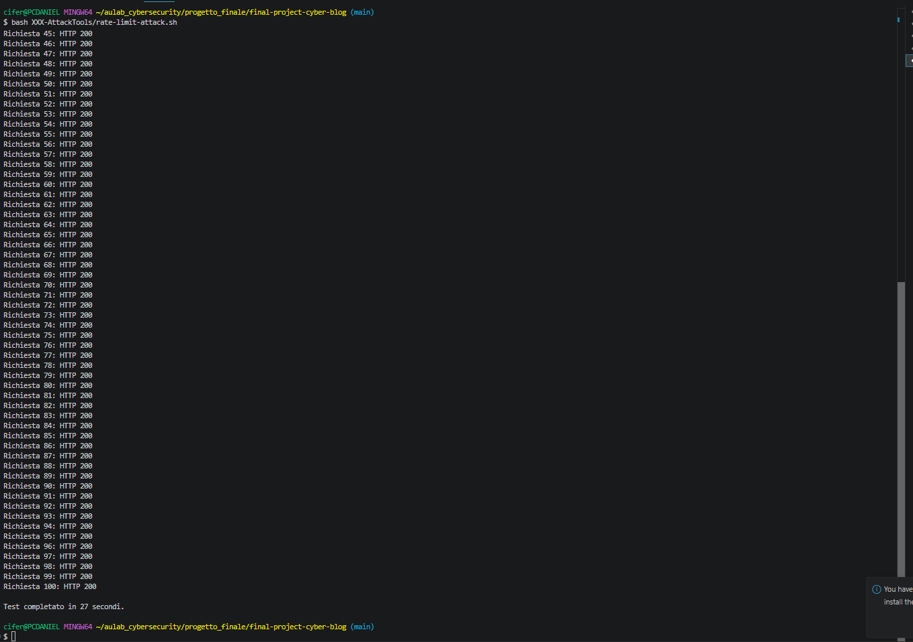
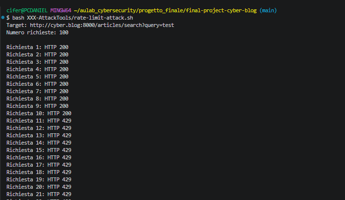
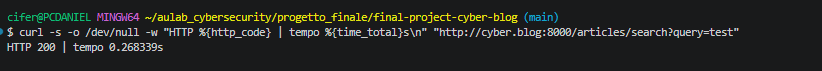

# Challenge 1 — Rate limiter mancante

## Analisi iniziale

La rotta pubblica analizzata è:

`GET /articles/search`

La rotta non aveva alcun middleware di throttling. Ogni richiesta eseguiva nuovamente la ricerca degli articoli senza un limite per il client.

## Test prima della mitigazione

Ho creato lo script:

`XXX-AttackTools/rate-limit-attack.sh`

Lo script ha inviato 100 richieste consecutive alla rotta:

`http://cyber.blog:8000/articles/search?query=test`

Risultato ottenuto:

- 100 richieste con risposta `HTTP 200`;
- nessuna risposta `HTTP 429`;
- durata complessiva di circa 27 secondi.

### Evidenza prima della mitigazione

## Mitigazione

Ho registrato il rate limiter `article-search` nel file:

`app/Providers/AppServiceProvider.php`

Il limiter permette un massimo di 10 richieste al minuto per indirizzo IP.

Ho poi applicato il middleware:

`throttle:article-search`

alla rotta presente in:

`routes/web.php`

Ho scelto un limiter specifico per la ricerca, evitando di limitare globalmente tutte le funzionalità del sito.

## Retest

Ho svuotato la cache e rieseguito lo stesso script.

Risultato ottenuto:

- richieste dalla 1 alla 10: `HTTP 200`;
- richieste dalla 11 alla 100: `HTTP 429`.

### Evidenza dopo la mitigazione

Dopo circa un minuto, una nuova richiesta ha restituito nuovamente `HTTP 200`.

### Ripristino dopo la finestra temporale

Ho inoltre verificato manualmente dal browser che una normale ricerca continuasse a funzionare.

## Limiti del test

Il test è stato eseguito localmente con richieste sequenziali.

Il risultato dimostra l'assenza iniziale del rate limiter e il corretto blocco dopo la mitigazione, ma non rappresenta una simulazione completa di un attacco distribuito o concorrente.