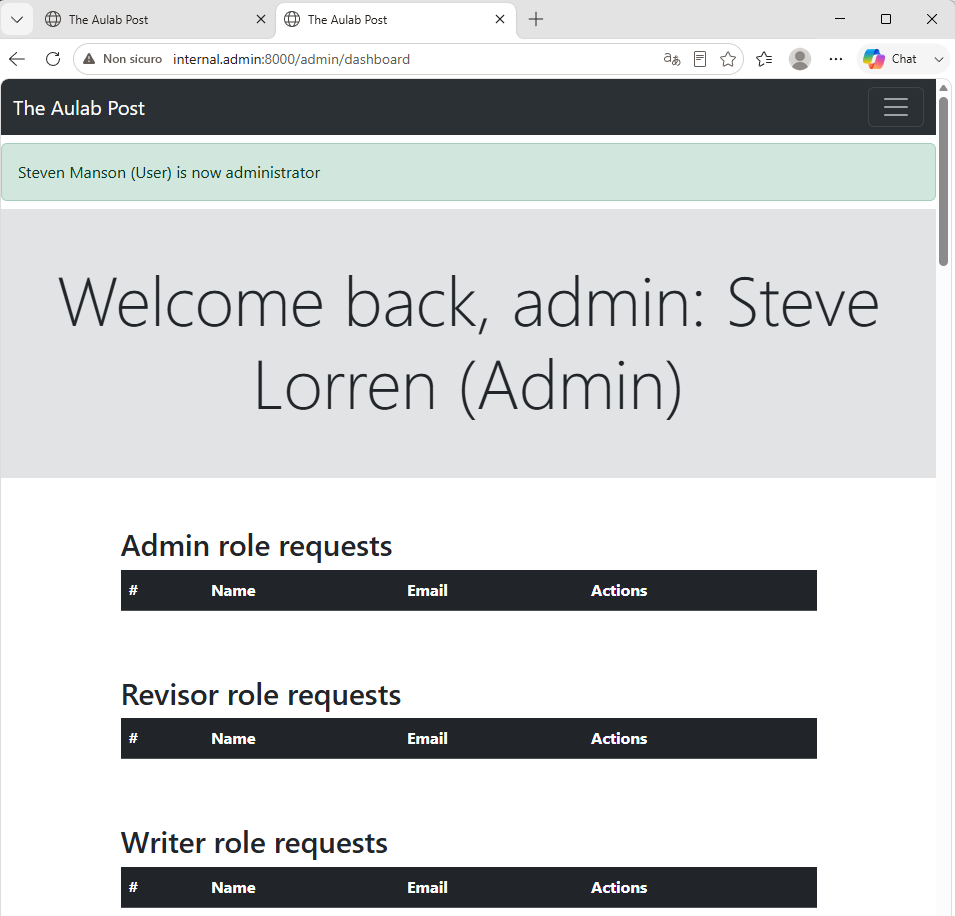
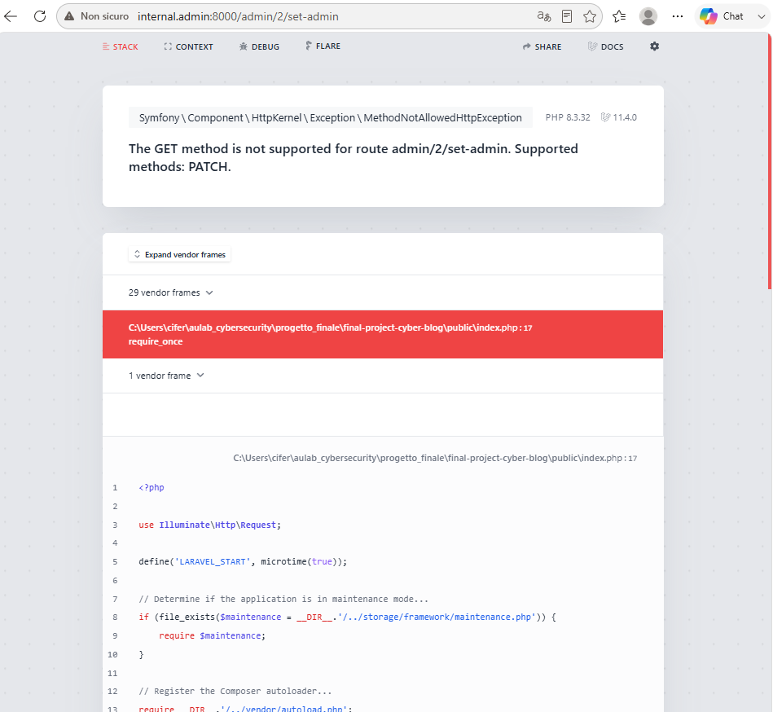
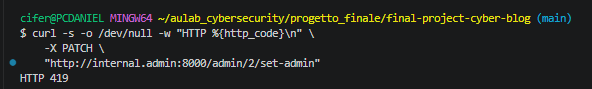

# Challenge 2 — Operazioni critiche tramite GET

## Analisi iniziale

Le operazioni di assegnazione dei ruoli utilizzavano richieste `GET`:

- `/admin/{user}/set-admin`
- `/admin/{user}/set-revisor`
- `/admin/{user}/set-writer`

Queste rotte modificavano dati applicativi, ma non richiedevano un token CSRF.

Una pagina esterna poteva quindi richiamare una delle rotte sfruttando la sessione già attiva dell'amministratore.

## Test prima della mitigazione

Ho utilizzato la pagina presente in:

`XXX-AttackTools/csrf/index.html`

La pagina eseguiva automaticamente una richiesta verso:

`http://internal.admin:8000/admin/2/set-admin`

Prima dell'attacco, l'utente con ID 2 aveva:

`is_admin = 0`

Con la sessione dell'amministratore attiva, l'apertura della pagina esterna ha promosso l'utente ad amministratore.

Dopo l'attacco:

`is_admin = 1`

### Evidenza prima della mitigazione

## Mitigazione

Ho modificato le tre rotte in `routes/web.php`, sostituendo il metodo `GET` con `PATCH`.

Ho inoltre sostituito i collegamenti presenti in:

`resources/views/components/requests-table.blade.php`

con form contenenti:

- `@csrf`
- `@method('PATCH')`

In questo modo l'operazione richiede il metodo HTTP corretto e un token CSRF valido associato alla sessione.

## Retest

Dopo aver ripristinato l'utente con:

`is_admin = 0`

ho aperto nuovamente la stessa pagina esterna.

La richiesta `GET` è stata rifiutata perché la rotta supporta esclusivamente `PATCH`.

Risultato:

`405 Method Not Allowed`

### Evidenza dopo la mitigazione

Ho verificato nuovamente il database e il valore è rimasto:

`is_admin = 0`

Ho inoltre inviato una richiesta `PATCH` senza token CSRF.

Risultato:

`HTTP 419`

### Verifica della protezione CSRF

## Verifica funzionale

La dashboard amministrativa continua a caricarsi correttamente dopo la modifica delle rotte e della vista.

## Conclusione

Le operazioni che modificano i ruoli non sono più eseguibili tramite richieste `GET`.

Una richiesta `PATCH` deve inoltre contenere un token CSRF valido, impedendo a una pagina esterna di utilizzare la sessione dell'amministratore per modificare i ruoli.