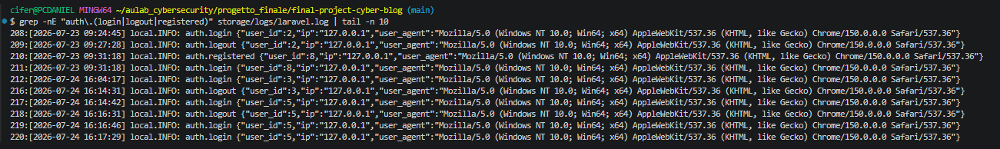
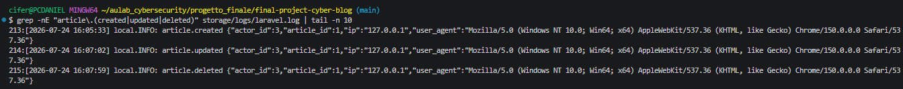
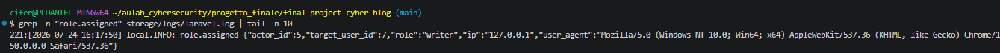

# Challenge 3 — Logging delle operazioni critiche

## Analisi iniziale

L'applicazione non registrava log applicativi per le principali operazioni sensibili.

In caso di incidente non era quindi possibile ricostruire con precisione:

- quale utente avesse eseguito un'operazione;
- quale risorsa fosse stata coinvolta;
- da quale indirizzo IP fosse partita la richiesta;
- quale client fosse stato utilizzato.

La configurazione Laravel utilizza il canale `stack` con output sul file:

`storage/logs/laravel.log`

## Mitigazione

Ho aggiunto log strutturati per tre categorie di eventi:

1. autenticazione;
2. gestione degli articoli;
3. assegnazione dei ruoli.

I log contengono soltanto dati utili all'audit, come identificativi, IP e user agent.

Non vengono registrati password, token, cookie o contenuti completi delle richieste.

## Logging dell'autenticazione

In `app/Providers/AppServiceProvider.php` ho registrato listener per gli eventi Laravel:

- `Login`
- `Logout`
- `Registered`

Gli eventi prodotti sono:

- `auth.login`
- `auth.logout`
- `auth.registered`

Ogni evento registra:

- `user_id`
- `ip`
- `user_agent`

### Evidenza dei log di autenticazione

## Logging degli articoli

In `app/Http/Controllers/ArticleController.php` ho aggiunto i seguenti eventi:

- `article.created`
- `article.updated`
- `article.deleted`

Ogni evento registra:

- `actor_id`
- `article_id`
- `ip`
- `user_agent`

Ho creato un articolo temporaneo, l'ho modificato e infine eliminato.

Le tre operazioni sono state registrate con lo stesso `article_id`.

### Evidenza dei log degli articoli

## Logging delle assegnazioni di ruolo

In `app/Http/Controllers/AdminController.php` ho aggiunto l'evento:

`role.assigned`

Il log registra:

- `actor_id`
- `target_user_id`
- `role`
- `ip`
- `user_agent`

Per il test, un amministratore ha assegnato temporaneamente il ruolo writer a un utente.

Dopo la verifica, il database locale è stato ripristinato allo stato iniziale.

### Evidenza del log di assegnazione ruolo

## Verifica funzionale

Ho verificato che:

- login, logout e registrazione continuino a funzionare;
- creazione, modifica ed eliminazione degli articoli continuino a funzionare;
- l'assegnazione dei ruoli continui a funzionare;
- i dati temporanei utilizzati nei test siano stati eliminati o ripristinati.

## Conclusione

Le operazioni critiche sono ora tracciabili attraverso log strutturati.

In caso di attività anomala è possibile identificare l'utente coinvolto, la risorsa modificata, l'indirizzo IP e il client utilizzato, senza memorizzare dati sensibili.