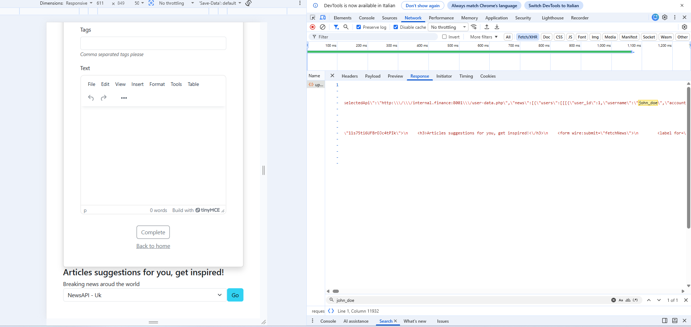
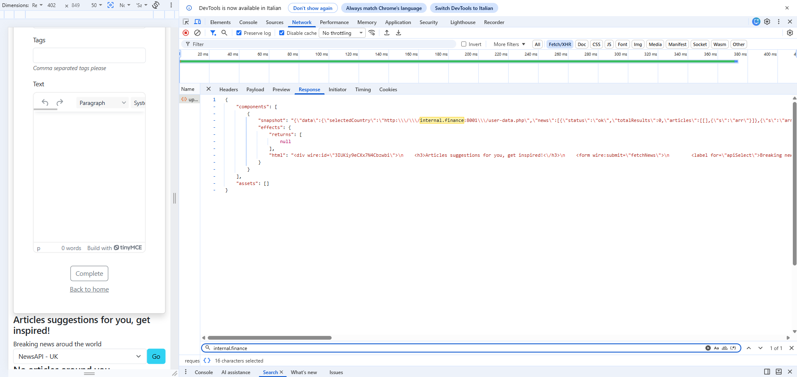
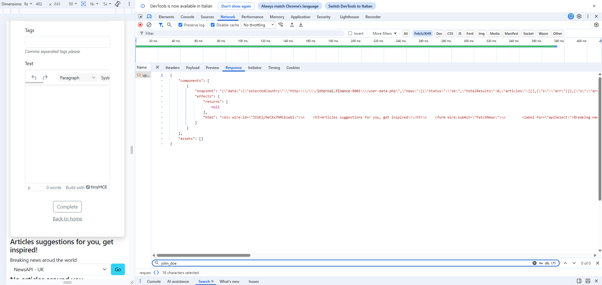

# Challenge 4 — Server-Side Request Forgery

## Analisi iniziale

Il componente Livewire dedicato alle ultime notizie permetteva al client di inviare un URL completo al backend.

Il valore selezionato nella pagina veniva memorizzato nella proprietà:

`selectedApi`

e successivamente passato direttamente al metodo:

`HttpService::getRequest()`

La validazione presente controllava soltanto che il valore fosse un URL sintatticamente valido tramite `FILTER_VALIDATE_URL`.

Questo controllo non impediva però di utilizzare un indirizzo interno autorizzato dal servizio HTTP.

Tra i domini consentiti era presente:

`internal.finance`

Un writer poteva quindi modificare il valore di una delle opzioni della select e impostarlo su:

`http://internal.finance:8001/user-data.php`

Il server Laravel eseguiva la richiesta verso il servizio interno e inseriva i dati finanziari nella response Livewire.

Questo comportamento costituisce una vulnerabilità SSRF, perché il server viene utilizzato per accedere a una risorsa che non sarebbe direttamente raggiungibile dall'utente.

## Test prima della mitigazione

Ho effettuato il test accedendo come writer alla pagina:

`/articles/create`

Attraverso gli strumenti di sviluppo del browser ho modificato il valore di una delle opzioni della select, sostituendo l'URL di NewsAPI con:

`http://internal.finance:8001/user-data.php`

Dopo aver inviato il form Livewire, nella response della richiesta `livewire/update` erano presenti:

- l'URL interno manomesso;
- i dati restituiti dalla Financial App;
- il valore `john_doe`.

### Evidenza prima della mitigazione

## Mitigazione

La mitigazione è stata applicata su più livelli.

### Riduzione dell'input controllato dal client

Nel componente Livewire la proprietà:

`selectedApi`

è stata sostituita con:

`selectedCountry`

Il browser non invia più un URL completo, ma soltanto uno dei codici Paese consentiti:

- `it`
- `gb`
- `us`

La validazione server-side utilizza:

`Rule::in(['it', 'gb', 'us'])`

L'host, il percorso e la chiave API vengono costruiti esclusivamente dal backend.

### Protezione della chiave API

La chiave NewsAPI non è più presente nei valori HTML della select.

Viene recuperata lato server tramite:

`config('services.newsapi.api_key')`

La configurazione utilizza la variabile d'ambiente:

`NEWSAPI_API_KEY`

### Controllo dell'autorizzazione

L'azione Livewire verifica lato server che l'utente autenticato possieda il ruolo writer.

Il controllo non dipende quindi soltanto dalla visibilità della pagina o del componente.

### Rafforzamento di HttpService

Il servizio HTTP ora utilizza una allowlist esplicita.

Per NewsAPI sono consentiti soltanto:

- protocollo `HTTPS`;
- host `newsapi.org`;
- percorso `/v2/top-headlines`.

Per la Financial App sono consentiti soltanto:

- protocollo `HTTP`;
- host `internal.finance`;
- porta `8001`;
- percorso `/user-data.php`;
- utenti autenticati con ruolo amministratore.

Sono stati inoltre configurati:

- timeout di connessione;
- timeout complessivo;
- redirect disabilitati;
- rifiuto degli URL con credenziali incorporate;
- header `Referer` aggiunto esclusivamente alla richiesta interna autorizzata.

## Retest

Dopo la mitigazione ho nuovamente modificato il valore della select impostandolo su:

`http://internal.finance:8001/user-data.php`

La richiesta Livewire ha ricevuto il valore manomesso, ma la validazione di `selectedCountry` lo ha respinto perché non apparteneva alla lista consentita.

### Evidenza del valore manomesso

Nella response non erano più presenti dati provenienti dalla Financial App.

La ricerca del valore:

`john_doe`

ha restituito zero risultati.

### Evidenza dell'assenza dei dati

## Verifica funzionale

Ho verificato che:

- la selezione normale delle sorgenti NewsAPI continui a funzionare;
- il writer non possa utilizzare il componente per interrogare `internal.finance`;
- la dashboard amministrativa continui ad accedere legittimamente alla Financial App;
- la chiave NewsAPI non sia più esposta nell'HTML;
- nessun numero di carta o CVV sia stato inserito nella documentazione.

## Conclusione

La vulnerabilità SSRF è stata mitigata eliminando gli URL controllabili dal client e introducendo validazione, allowlist e autorizzazione server-side.

Il writer può richiedere soltanto le sorgenti di notizie previste dall'applicazione, mentre il servizio finanziario interno rimane accessibile esclusivamente agli amministratori autorizzati.