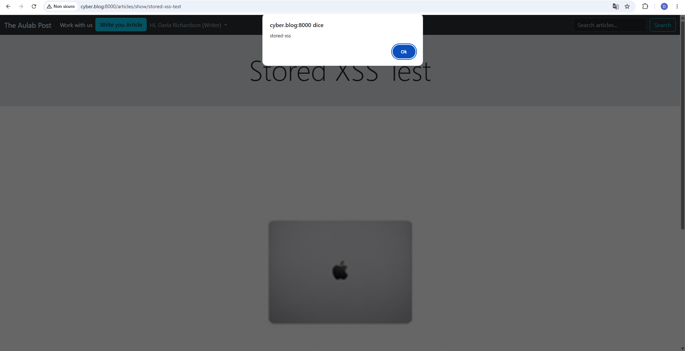
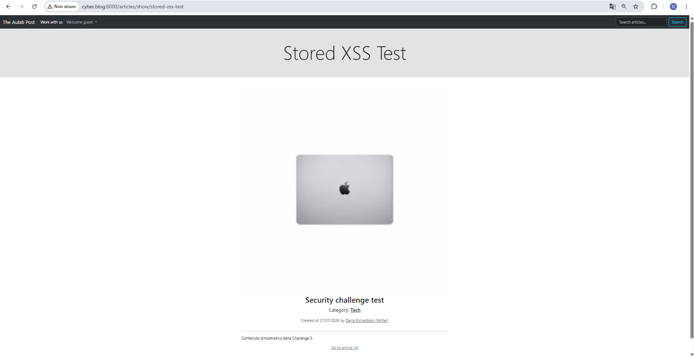
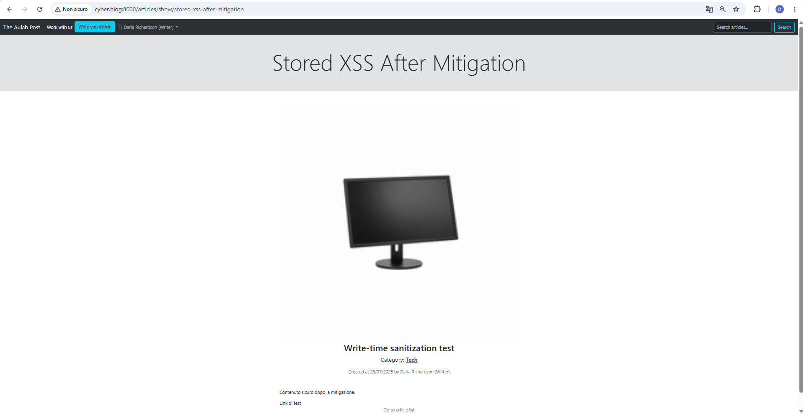
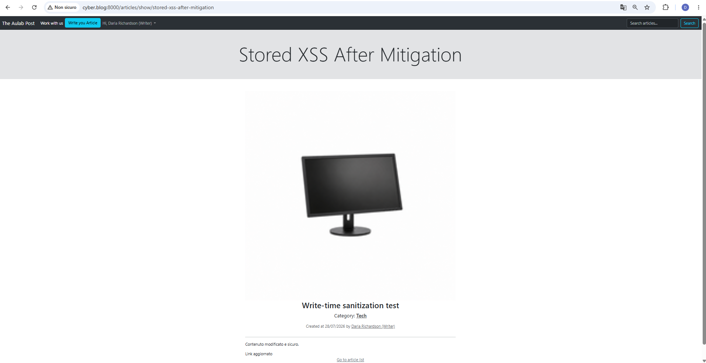

# Challenge 5 — Stored Cross-Site Scripting

## Analisi iniziale

Il contenuto degli articoli veniva ricevuto dal backend attraverso il campo `body`.

Nei metodi `store()` e `update()` del controller era presente esclusivamente una validazione relativa alla presenza e alla lunghezza minima del contenuto:

```php
'body' => 'required|min:10',
```

Dopo la validazione, il valore proveniente dalla richiesta veniva salvato direttamente nel database:

```php
'body' => $request->body,
```

Nella pagina di dettaglio dell’articolo, il body veniva renderizzato attraverso la sintassi Blade non escaped:

```blade
<p>{!! $article->body !!}</p>
```

Questa sintassi permette di interpretare correttamente l’HTML generato dall’editor TinyMCE, ma il contenuto non veniva sottoposto ad alcuna sanitizzazione.

Un utente con ruolo writer poteva quindi modificare manualmente la richiesta HTTP e inserire nel body dell’articolo del codice JavaScript.

Il payload veniva:

1. accettato dal server;
2. salvato nel database;
3. restituito nella pagina dell’articolo;
4. interpretato ed eseguito dal browser.

Il comportamento identificato corrispondeva a una vulnerabilità **Stored Cross-Site Scripting**, perché il payload rimaneva persistente nel database e veniva eseguito durante le visite successive alla pagina compromessa.

---

## Test prima della mitigazione

Per dimostrare la vulnerabilità è stato utilizzato un payload innocuo contenente un semplice `alert()`:

```html
<p>Contenuto dimostrativo della Challenge 5.</p>
<script>alert('stored-xss')</script>
```

Attraverso gli strumenti di sviluppo del browser è stato intercettato il form di creazione dell’articolo.

Il campo `body` del `FormData` è stato sostituito con il payload prima dell’invio della richiesta.

La risposta del server ha confermato la corretta elaborazione del form:

```text
status: 200
redirected: true
finalUrl: http://cyber.blog:8000/
```

La verifica tramite Laravel Tinker ha confermato che il payload era stato memorizzato nel database:

```html
<p>Contenuto dimostrativo della Challenge 5.</p>
<script>alert('stored-xss')</script>
```

Aprendo la pagina:

```text
/articles/show/stored-xss-test
```

il browser ha eseguito il codice JavaScript e mostrato l’alert:

```text
stored-xss
```

## Evidenza prima della mitigazione



---

## Impatto

Un utente autorizzato a creare o modificare articoli avrebbe potuto inserire codice JavaScript eseguito nel browser di chiunque visualizzasse il contenuto compromesso.

Le possibili conseguenze includevano:

- modifica del contenuto della pagina;
- visualizzazione di messaggi o interfacce ingannevoli;
- esecuzione di azioni nel contesto dell’utente autenticato;
- accesso ai dati disponibili nel DOM della pagina;
- invio di richieste non previste dall’applicazione;
- compromissione delle sessioni in assenza di ulteriori misure di protezione.

La natura persistente della vulnerabilità aumentava l’impatto, perché non era necessario convincere ogni vittima ad aprire un URL appositamente costruito: era sufficiente visitare normalmente l’articolo compromesso.

---

## Mitigazione

La vulnerabilità è stata mitigata applicando una strategia di **defense in depth**.

Il contenuto HTML viene ora sanitizzato:

1. prima della creazione dell’articolo;
2. prima della modifica dell’articolo;
3. prima della visualizzazione dell’articolo.

In questo modo vengono protetti sia i nuovi contenuti sia quelli malevoli già presenti nel database.

---

## Installazione di HTML Purifier

È stata aggiunta al progetto la dipendenza:

```text
ezyang/htmlpurifier
```

HTML Purifier analizza la struttura del markup e conserva esclusivamente gli elementi e gli attributi esplicitamente consentiti.

A differenza di un filtro basato su espressioni regolari, il sanitizzatore interpreta la struttura dell’HTML e gestisce correttamente differenti vettori XSS.

---

## Servizio di sanitizzazione

È stato creato il servizio:

```text
app/Services/HtmlSanitizer.php
```

Il servizio utilizza una allowlist di elementi HTML necessari alla formattazione degli articoli.

Tra gli elementi consentiti sono presenti:

- paragrafi e interruzioni di riga;
- grassetto, corsivo, sottolineato e barrato;
- liste ordinate e non ordinate;
- titoli;
- citazioni;
- collegamenti;
- tabelle.

La configurazione non consente elementi o attributi pericolosi come:

```text
script
iframe
onclick
onerror
```

Per i collegamenti sono ammessi esclusivamente gli schemi:

```text
http
https
mailto
```

Gli URL basati sullo schema `javascript:` vengono quindi eliminati.

Il metodo pubblico del servizio è:

```php
public function clean(?string $html): string
{
    return $this->purifier->purify($html ?? '');
}
```

---

## Verifica del sanitizzatore

Il servizio è stato testato con il seguente contenuto:

```html
<p>Test <strong>sicuro</strong></p>
<script>alert(1)</script>
<a href="javascript:alert(2)" onclick="alert(3)">link</a>
```

Il risultato restituito è stato:

```html
<p>Test <strong>sicuro</strong></p><a>link</a>
```

Il test ha confermato che:

- il paragrafo è stato mantenuto;
- il tag `strong` è stato mantenuto;
- il tag `script` è stato eliminato;
- l’attributo `onclick` è stato eliminato;
- l’URL con schema `javascript:` è stato eliminato.

---

## Integrazione nel controller

Il servizio `HtmlSanitizer` è stato iniettato nel controller tramite dependency injection:

```php
public function __construct(
    private HtmlSanitizer $htmlSanitizer
) {
}
```

Laravel risolve automaticamente il servizio attraverso il proprio service container.

---

## Sanitizzazione durante la creazione

Nel metodo `store()` il body viene sanitizzato dopo la validazione e prima della creazione dell’articolo:

```php
$cleanBody = $this->htmlSanitizer->clean($request->body);
```

Il valore pulito viene quindi salvato nel database:

```php
'body' => $cleanBody,
```

Il flusso è diventato:

```text
body ricevuto dalla richiesta
        ↓
validazione Laravel
        ↓
sanitizzazione HTML
        ↓
salvataggio nel database
```

---

## Sanitizzazione durante la modifica

La stessa protezione è stata aggiunta al metodo `update()`:

```php
$cleanBody = $this->htmlSanitizer->clean($request->body);
```

Anche durante l’aggiornamento viene salvato soltanto il valore sanitizzato:

```php
'body' => $cleanBody,
```

Questa protezione impedisce che un articolo inizialmente sicuro venga trasformato successivamente in un contenuto Stored XSS.

---

## Sanitizzazione durante la visualizzazione

La sanitizzazione in scrittura protegge i nuovi salvataggi, ma non elimina automaticamente eventuali payload già presenti nel database.

Per questo motivo è stato aggiunto un secondo controllo nel metodo `show()`:

```php
$sanitizedBody = $this->htmlSanitizer->clean($article->body);
```

Alla vista vengono passati sia l’articolo sia il body sanitizzato:

```php
return view(
    'articles.show',
    compact('article', 'sanitizedBody')
);
```

La Blade utilizza esclusivamente il valore pulito:

```blade
<div>{!! $sanitizedBody !!}</div>
```

La sintassi non escaped viene mantenuta perché il contenuto deve continuare a supportare l’HTML legittimo prodotto da TinyMCE.

Il valore renderizzato, però, non proviene più direttamente dal database: viene prima analizzato e sanitizzato.

Il flusso è diventato:

```text
body presente nel database
        ↓
sanitizzazione con HTML Purifier
        ↓
$sanitizedBody
        ↓
rendering dell’HTML consentito
```

---

## Retest dell’articolo già compromesso

Dopo la mitigazione è stato riaperto l’articolo utilizzato per il test iniziale.

Il payload era ancora presente nel database:

```html
<p>Contenuto dimostrativo della Challenge 5.</p>
<script>alert('stored-xss')</script>
```

Questa condizione ha permesso di verificare direttamente la protezione applicata durante la visualizzazione.

Nel browser:

- il titolo dell’articolo veniva mostrato correttamente;
- il testo legittimo veniva visualizzato;
- lo script non veniva eseguito;
- non compariva alcun alert.

La protezione in lettura ha quindi neutralizzato anche un contenuto malevolo già memorizzato.

## Evidenza della protezione in lettura



---

## Retest della creazione

Dopo la mitigazione è stato creato un nuovo articolo inviando un body contenente:

- un tag `script`;
- un attributo `onclick`;
- un collegamento con schema `javascript:`.

Il payload utilizzato comprendeva contenuto HTML legittimo e contenuto pericoloso.

Dopo l’elaborazione del metodo `store()`, nel database è stato memorizzato soltanto:

```html
<p>Contenuto sicuro dopo la mitigazione.</p>
<a>Link di test</a>
```

Non erano più presenti:

```text
script
onclick
javascript:
```

Il test ha confermato che il contenuto pericoloso viene eliminato prima del salvataggio, mentre l’HTML consentito viene mantenuto.

## Evidenza della protezione durante la creazione



---

## Retest della modifica

È stato eseguito un ulteriore tentativo di Stored XSS attraverso il form di modifica dell’articolo.

La richiesta di aggiornamento conteneva:

- un tag `script`;
- un attributo `onclick`;
- un URL con schema `javascript:`.

Dopo l’elaborazione del metodo `update()`, il database conteneva soltanto:

```html
<p>Contenuto modificato e sicuro.</p>
<a>Link aggiornato</a>
```

Non erano presenti:

```text
script
onclick
javascript:
stored-xss-update
```

Aprendo nuovamente la pagina dell’articolo:

- il contenuto aggiornato veniva mostrato correttamente;
- non veniva eseguito alcun JavaScript;
- non compariva alcun alert.

## Evidenza della protezione durante la modifica



---

## Verifica funzionale

Dopo la mitigazione è stato verificato che:

- la creazione degli articoli continui a funzionare;
- la modifica degli articoli continui a funzionare;
- la visualizzazione degli articoli continui a funzionare;
- la formattazione HTML consentita venga mantenuta;
- gli elementi `script` vengano rimossi;
- gli event handler JavaScript vengano rimossi;
- gli URL con schema `javascript:` vengano eliminati;
- i payload già presenti nel database non vengano eseguiti;
- i nuovi payload non vengano salvati;
- i payload inviati durante una modifica non vengano salvati.

Sono stati inoltre eseguiti i controlli sintattici sui file PHP modificati:

```text
No syntax errors detected in app/Services/HtmlSanitizer.php
No syntax errors detected in app/Http/Controllers/ArticleController.php
```

Il comando:

```bash
git diff --check
```

non ha segnalato errori di whitespace.

---

## Conclusione

La vulnerabilità Stored Cross-Site Scripting è stata mitigata introducendo una sanitizzazione HTML basata su allowlist.

Il contenuto viene ora filtrato:

1. prima della creazione;
2. prima della modifica;
3. prima della visualizzazione.

La sanitizzazione in scrittura impedisce l’inserimento di nuovi payload nel database.

La sanitizzazione in lettura protegge anche dai contenuti malevoli già memorizzati.

La formattazione legittima prodotta da TinyMCE viene conservata, mentre tag, attributi e protocolli potenzialmente pericolosi vengono eliminati.

La Challenge 5 può quindi considerarsi completata dal punto di vista dell’analisi, della mitigazione e del retest.