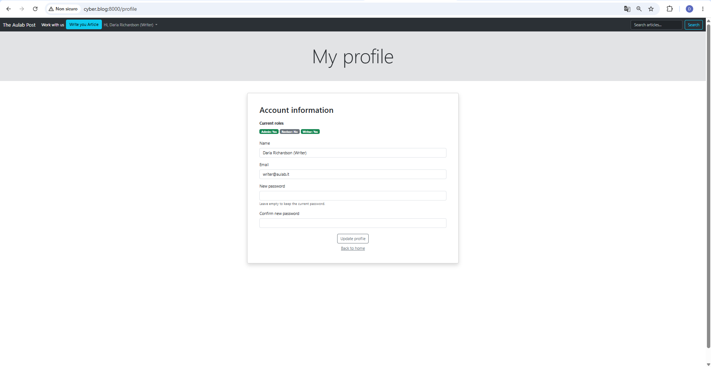
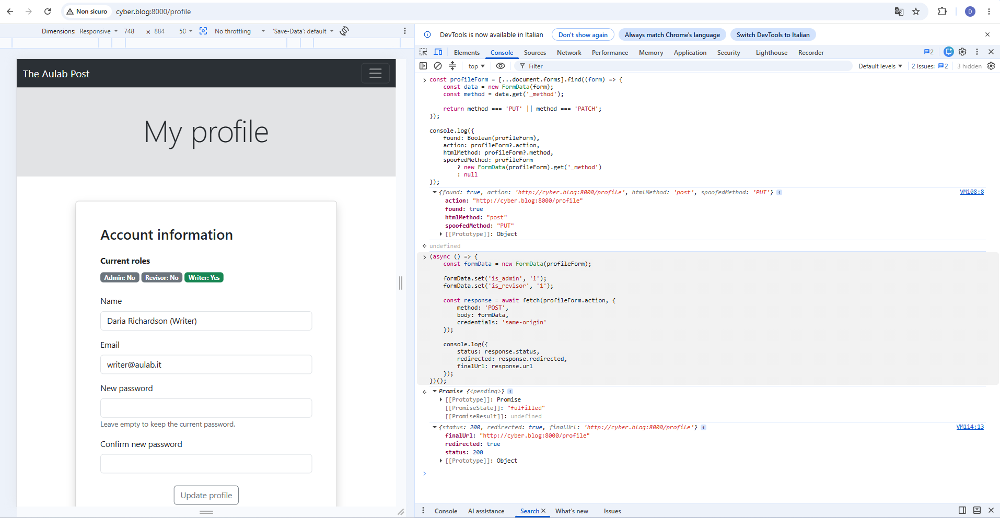
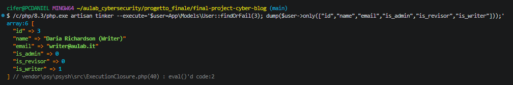

# Challenge 6 — Mass Assignment

## Analisi iniziale

Nel modello `User` erano presenti tra gli attributi mass assignable anche i campi utilizzati per gestire i ruoli:

```php
protected $fillable = [
    'name',
    'email',
    'password',
    'is_admin',
    'is_revisor',
    'is_writer',
];
```

I campi:

```text
is_admin
is_revisor
is_writer
```

controllano i privilegi degli utenti e non dovrebbero essere modificabili attraverso una normale richiesta di aggiornamento del profilo.

La presenza di questi attributi in `$fillable`, da sola, rappresentava una configurazione pericolosa.

La vulnerabilità diventava concretamente sfruttabile quando l’input della richiesta veniva passato direttamente a un metodo di mass assignment, ad esempio:

```php
$user->update($request->all());
```

In questa situazione il backend accettava tutti i parametri inviati dal client, compresi quelli non presenti nel form HTML.

Nascondere un campo nell’interfaccia non costituisce infatti una protezione: un utente può modificare manualmente la richiesta HTTP e aggiungere ulteriori parametri.

---

## Funzionalità del profilo

Per la Challenge è stata realizzata una pagina profilo accessibile agli utenti autenticati.

La pagina permette di modificare:

- nome;
- indirizzo email;
- password.

Sono state aggiunte le rotte:

```text
GET /profile
PUT /profile
```

con i nomi:

```text
profile.edit
profile.update
```

Le rotte sono protette dal middleware:

```php
auth
```

La navbar contiene inoltre un collegamento alla pagina del profilo:

```blade
<a class="dropdown-item" href="{{ route('profile.edit') }}">
    Profile
</a>
```

---

## Implementazione vulnerabile

La prima versione dell’aggiornamento del profilo è stata realizzata intenzionalmente in modo vulnerabile, passando direttamente alla funzione `update()` tutti i dati ricevuti dalla richiesta.

Il comportamento era equivalente a:

```php
$user->update($request->all());
```

Poiché i campi dei ruoli erano presenti in `$fillable`, un utente poteva aggiungere manualmente alla richiesta un parametro come:

```text
is_admin=1
```

anche se il campo non era presente nel form visibile.

Il flusso vulnerabile era quindi:

```text
richiesta controllata dal client
        ↓
$request->all()
        ↓
mass assignment
        ↓
aggiornamento anche dei campi di privilegio
```

---

## Test prima della mitigazione

Il test è stato eseguito utilizzando l’utente:

```text
Daria Richardson (Writer)
```

con i seguenti privilegi iniziali:

```text
is_admin   = 0
is_revisor = 0
is_writer  = 1
```

Attraverso gli strumenti di sviluppo del browser è stata modificata la richiesta di aggiornamento del profilo aggiungendo manualmente un campo non presente nel form:

```text
is_admin=1
```

La richiesta è stata accettata dal server.

Poiché `is_admin` era incluso in `$fillable` e l’intero contenuto della richiesta veniva passato al metodo `update()`, il valore è stato salvato nel database.

L’utente writer è riuscito quindi a modificare autonomamente il proprio ruolo e a ottenere privilegi amministrativi.

Questo comportamento confermava una vulnerabilità di **Mass Assignment con privilege escalation**.

## Evidenza prima della mitigazione



---

## Impatto

Un utente autenticato avrebbe potuto alterare campi non previsti dalla funzionalità del profilo.

Nel caso analizzato, un normale writer poteva modificare i campi:

```text
is_admin
is_revisor
is_writer
```

e aumentare autonomamente i propri privilegi.

Le possibili conseguenze includevano:

- accesso alla dashboard amministrativa;
- gestione dei ruoli degli altri utenti;
- accesso alle funzionalità riservate ai revisori;
- approvazione o rifiuto degli articoli;
- modifica di categorie e tag;
- esecuzione di operazioni non autorizzate;
- compromissione del sistema di autorizzazione dell’applicazione.

La vulnerabilità non dipendeva dalla presenza dei campi nel form HTML, ma dal fatto che il backend considerasse affidabili tutti i dati inviati dal client.

---

## Mitigazione

La vulnerabilità è stata mitigata applicando più livelli di protezione:

1. validazione esplicita dei campi aggiornabili;
2. utilizzo esclusivo dei dati restituiti dalla validazione;
3. rimozione dei campi di privilegio da `$fillable`;
4. protezione delle rotte tramite middleware `auth`.

Questo approccio riduce il rischio sia nell’attuale endpoint del profilo sia in eventuali utilizzi futuri del modello `User`.

---

## Validazione tramite allowlist

Nel metodo `update()` vengono definiti esplicitamente i soli campi che il profilo è autorizzato a modificare:

```php
$validated = $request->validate([
    'name' => 'required|string|max:255',
    'email' => 'required|email|max:255|unique:users,email,' . $user->id,
    'password' => 'nullable|confirmed|min:8',
]);
```

La validazione funziona come una allowlist.

Soltanto questi campi possono essere presenti nell’array `$validated`:

```text
name
email
password
```

Parametri aggiunti manualmente come:

```text
is_admin
is_revisor
is_writer
```

non sono inclusi nelle regole e quindi non vengono trasferiti nell’array utilizzato per l’aggiornamento.

---

## Aggiornamento dei soli dati validati

Dopo la validazione, il controller non utilizza più l’intero contenuto della richiesta.

L’aggiornamento avviene esclusivamente tramite:

```php
$user->update($validated);
```

Il flusso mitigato è quindi:

```text
richiesta controllata dal client
        ↓
validazione con allowlist
        ↓
$validated
        ↓
aggiornamento dei soli campi autorizzati
```

Anche se un utente aggiunge parametri ulteriori alla richiesta, questi non vengono passati al metodo `update()`.

---

## Gestione della password opzionale

La password può essere lasciata vuota quando l’utente desidera modificare soltanto nome o email.

Nel controller è presente il controllo:

```php
if (!$request->filled('password')) {
    unset($validated['password']);
}
```

In questo modo una password vuota non sostituisce il valore già presente nel database.

Il modello `User` utilizza inoltre il cast:

```php
'password' => 'hashed',
```

Laravel applica quindi automaticamente l’hashing quando viene fornita una nuova password valida.

---

## Protezione del modello User

Dal modello `User` sono stati rimossi i campi relativi ai ruoli.

La configurazione mitigata è:

```php
protected $fillable = [
    'name',
    'email',
    'password',
];
```

Non sono più mass assignable:

```text
is_admin
is_revisor
is_writer
```

Questo costituisce un secondo livello di protezione.

Anche se in futuro un altro endpoint utilizzasse accidentalmente un aggiornamento tramite mass assignment, i campi di privilegio non potrebbero essere modificati direttamente attraverso `update()` o `fill()`.

---

## Protezione delle rotte

Le rotte del profilo sono state inserite in un gruppo protetto dal middleware `auth`:

```php
Route::middleware('auth')->group(function () {
    Route::get('/profile', [ProfileController::class, 'edit'])
        ->name('profile.edit');

    Route::put('/profile', [ProfileController::class, 'update'])
        ->name('profile.update');
});
```

Le rotte effettivamente registrate sono:

```text
GET  /profile → profile.edit
PUT  /profile → profile.update
```

Un utente non autenticato non può quindi accedere alla pagina o inviare aggiornamenti del profilo.

---

## Form di aggiornamento

La vista utilizza una richiesta `POST` con method spoofing Laravel:

```blade
<form action="{{ route('profile.update') }}" method="POST">
    @csrf
    @method('PUT')
```

Il form contiene soltanto i campi previsti dalla funzionalità:

```text
name
email
password
password_confirmation
```

I ruoli vengono mostrati esclusivamente come informazioni non modificabili:

```text
Admin
Revisor
Writer
```

La sicurezza non dipende comunque dalla struttura del form, ma dai controlli applicati lato server.

---

## Retest dopo la mitigazione

Dopo la mitigazione è stato ripetuto il test utilizzando nuovamente l’utente writer.

Lo stato iniziale nel database era:

```text
id          = 3
is_admin    = 0
is_revisor  = 0
is_writer   = 1
```

Attraverso la Console del browser sono stati aggiunti manualmente al `FormData` i parametri:

```javascript
formData.set('is_admin', '1');
formData.set('is_revisor', '1');
```

La richiesta è stata inviata all’endpoint:

```text
PUT /profile
```

Il risultato mostrato dalla Console è stato:

```text
status: 200
redirected: true
finalUrl: http://cyber.blog:8000/profile
```

Il valore `redirected: true` indica che il server ha elaborato l’aggiornamento e reindirizzato nuovamente l’utente alla pagina del profilo.

Nonostante i parametri aggiunti manualmente, nella pagina risultavano ancora:

```text
Admin: No
Revisor: No
Writer: Yes
```

Questo dimostrava che i valori non erano stati applicati all’utente.

## Evidenza della richiesta dopo la mitigazione



---

## Verifica nel database

Dopo il tentativo è stata eseguita una verifica diretta tramite Laravel Tinker.

Il database conteneva ancora:

```text
is_admin   => 0
is_revisor => 0
is_writer  => 1
```

I parametri:

```text
is_admin=1
is_revisor=1
```

erano stati inviati dal client, ma non erano entrati nell’array `$validated` e non erano stati passati al metodo:

```php
$user->update($validated);
```

## Evidenza della verifica nel database



---

## Verifica funzionale

Dopo la mitigazione è stato verificato che:

- la pagina del profilo sia accessibile agli utenti autenticati;
- il nome possa essere aggiornato;
- l’indirizzo email possa essere aggiornato;
- l’unicità dell’email venga validata;
- la password possa essere lasciata vuota;
- una nuova password debba essere confermata;
- una nuova password debba contenere almeno otto caratteri;
- la password venga gestita tramite il cast `hashed`;
- i campi non previsti vengano esclusi dall’aggiornamento;
- `is_admin` non possa essere modificato dal profilo;
- `is_revisor` non possa essere modificato dal profilo;
- `is_writer` non possa essere modificato tramite mass assignment;
- i ruoli rimangano invariati nel database.

Sono stati inoltre eseguiti i controlli sintattici:

```text
No syntax errors detected in app/Http/Controllers/ProfileController.php
No syntax errors detected in app/Models/User.php
```

Il comando:

```bash
git diff --check
```

non ha segnalato errori di whitespace.

---

## Conclusione

La vulnerabilità di Mass Assignment è stata mitigata eliminando la fiducia indiscriminata nei dati ricevuti dal client.

Il controller utilizza ora soltanto un insieme esplicito di campi validati:

```text
name
email
password
```

I campi di privilegio sono stati inoltre rimossi da `$fillable`.

La protezione è quindi applicata su due livelli:

```text
allowlist nel controller
        +
restrizione degli attributi mass assignable nel modello
```

Il retest ha confermato che un utente writer può ancora aggiornare normalmente le proprie informazioni, ma non può più modificare i ruoli aggiungendo parametri arbitrari alla richiesta.

La privilege escalation riprodotta nella prima fase non è più possibile nel flusso del profilo testato.